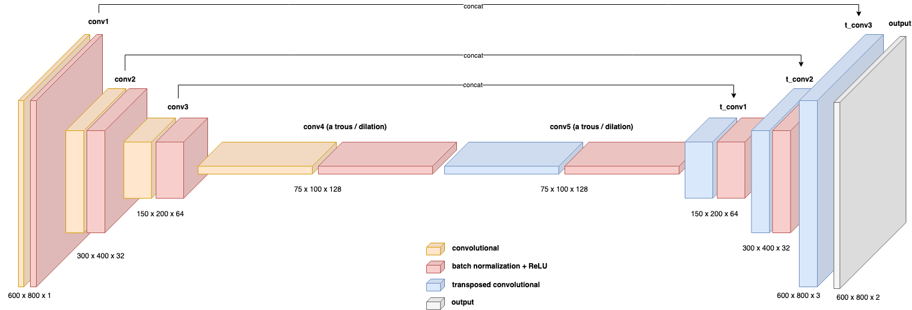
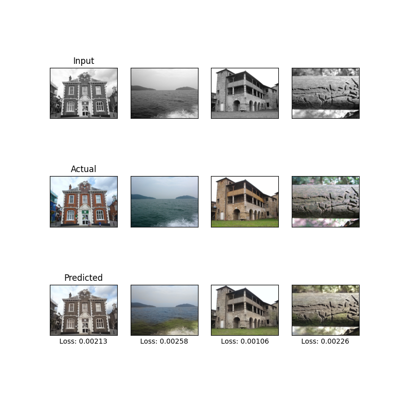

# Convolutional Autoencoder for Image Colorization

[](LICENSE)

## Overview

This project implements a Convolutional Autoencoder for image colorization. The model is designed to take grayscale images as input and generate corresponding colorized versions. It utilizes deep learning techniques, specifically convolutional neural networks, to learn the mapping between grayscale and color images.

## Features

- **Convolutional Autoencoder:** The core of the project is a convolutional autoencoder architecture, which learns to encode and decode image features to perform effective colorization.

- **Grayscale to Color:** The model is trained to transform grayscale images into their corresponding colorized versions, adding vibrancy and detail to the input images.

## Example
The 1st architecture was used to colorize images.

A visualization of the architecture (using [draw.io](draw.io)) is given below:


While many different parameters were tried, the best outputs were from the following parameters:
* Training on 28411 images.
* Number of parameters: 889082
* Running 30 epoch(s)
* Each epoch runs for 1421 iterations
* Example on the test set:
    

## Usage

### Prerequisites

- Python 3.x
- Dependencies: PyTorch, Matplotlib, Torchvision, Scikit-Image

### Installation

```bash
git clone https://github.com/g-nitin/convolutional-autoencoder.git
cd convolutional-autoencoder
pip install -r requirements.txt
```

### Training
This autoencoder was specifically designed to train on 600 by 800 pixel images. 
The `data` folder contains the `data_builder.py` file, which uses the [google-landmark](https://github.com/cvdfoundation/google-landmark) dataset to only fetch images of size 600 by 800.
To get the data, just run the `data_build.py` file, which will create a sub-folder (`google-landmark`) in `data`.
That sub-folder contains the `train` and `test` images in those sub-folders.

The code (running `main.py`) will generate a `results` folder which has sub-folders for each new model test.
To avoid pushing large amounts of data (in the `results` sub-folder), the sub-folder has been ignored.

### Notes
- If you are implementing another architecture, then it must be defined in `network.py` and subsequent changes must be made in `utilities.py`.


### License
This project is licensed under the MIT License - see the [LICENSE](LICENSE) file for details.

### Acknowledgments
The repository was inspired by George Kamtziridis' [articles](https://medium.com/mlearning-ai/building-an-image-colorization-neural-network-part-1-generative-models-and-autoencoders-d68f5769d484) and the respective [code](https://github.com/gkamtzir/cnn-image-colorization).

### Contributing
Feel free to contribute by opening issues or pull requests. Any feedback or improvements are welcome!

### Motivation
This project was inspired by MATH529 class at UofSC during the Fall 2023 semester.

### Contact
- **Email:** niting1209@gmail.com